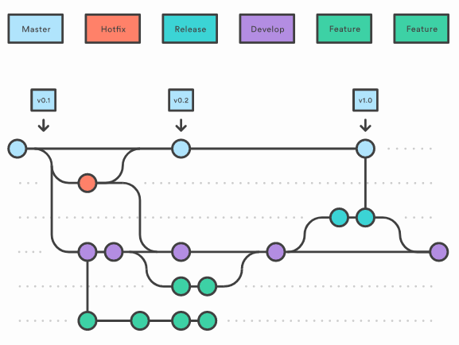

# Trade+ Admin

## Tech stack

- [React](https://facebook.github.io/react/) - a JavaScript library for building user interfaces.
- [MobX](https://mobx.js.org/) - a predictable State Container for JS Apps. State management "engine".
- [MobX State Tree](https://mobx-state-tree.js.org/) - is a state container system built on MobX, a functional reactive state library.
- [React Router](https://github.com/ReactTraining/react-router) - is declarative routing for React.
- [TypeScript](https://www.typescriptlang.org/) - is a typed superset of Javascript (used for type checking).
- [Styled Components](https://styled-components.com/) - is a CSS with superpowers (css in js approach).
- [Material UI](https://material-ui.com/) - is a React components library and design system.
- [Axios](https://github.com/axios/axios) - is a Promise based HTTP client.
- [Yarn](https://yarnpkg.com/) - is a package manager that doubles down as project manager.

## Code quality

- [ESLint](https://eslint.org/docs/user-guide/getting-started) - is a tool for identifying and reporting on patterns found in ECMAScript/JavaScript code, with the goal of making code more consistent and avoiding bugs.
- [TypeScript ESLint Parser](https://github.com/typescript-eslint/typescript-eslint#readme) - an ESLint parser which leverages TypeScript ESTree to allow for ESLint to lint TypeScript source code.
- [Prettier](https://prettier.io/docs/en/index.html) - is an opinionated code formatter.

## To start project (in develop mode)

To start project in develop mode please use next command:

```
yarn install
yarn start
```

If for some reasons browser tab doesn't open with self - go to http://localhost:3000/

## Project structure

## Source code structure:

```text
Each root directory can contain own README.md or CONTRIBUTING.md file

./.husky               // Husky hooks configs and scripts
./ci-scripts           // CI scripts
./build-config         // Build and Development configs
./.storybook           // Storybook configs

./public               // Static files

./src
|-- api                // Api containers
  |-- $entity          
    |-- index.tsx        // Container of Api route with all methods
    |-- routes.ts        // Entity Api routes
    |-- models           // Models (transformers) from/to FE/BE models (if need)
      |-- $entityMethod.tsx
|-- app                // Root component with global app data
|-- assets             // Images, styles, fonts, etc.
  |-- icons            // General application icons
|-- atoms              // The smallest possible components(ex: Button, Icon, Input, Title)
|-- components         // Common reusable components(can render other components, atoms or only have connect to store)
  |-- $entity
    |-- index.tsx
    |-- styled.tsx
    |-- $entity.stories.tsx
    |-- $entity.test.tsx
|-- constants          // Global application constants
|-- core               // DI container, Core Application services, such as logger, localStorage, sessionStorage, etc.
|-- hooks              // Reusable Hooks
|-- providers          // Context Providers components
|-- scenes             // Application components related to scene
  |-- routes             // Routes and configs
  |-- layouts            // Page global layouts
  |-- pages              // Pages (should be located inside layouts)
|-- serviceWorkers     // Service-workers directory with all dependencies
|-- store              // MobX stores entities with utils(Service, Models)
  |-- $entity
    |-- actions          // Folder or File with All thunks
    |-- model            // Should export `$entityModel` (mainFile) Can contain all stuff related to store (model, views, modelActions)
    |-- views            // Should export `$entityViews` (if present - should import and use model)
    |-- modelActions     // Should export `$entityActions` (if present - should import and use views)
    |-- modelType.ts     // Should export type T`$entityModel` = Instance<typeof $entityModel>; (to prevent cycle dependency - will be use in actions)
    |-- index.ts         // Should re-export `$entityActions` as `$entity` (if you have only model file - re-export `$entityModel` as `$entity`)
|-- tests              // Tests configs
|-- themes             // Material-UI themes configs
|-- utils              // Common Reusable utils
|-- index.tsx          // Application entry point

./typings              // Typescript global typings
```

## Git Workflow

Current project is following to next Git workflow:



### Branches permissions

| Name    | Write access    | Merge via PR    |
| :------ | :-------------- | :-------------- |
| master  | nobody          | @Dmitriy Muliak |
| develop | @Dmitriy Muliak | Everybody       |

### Branches description

- **develop** - this is the mainline branch that will be ongoing.
- **feature** - these branches will be used to develop tasks/features and should be clearly marked with the bug id and relevant to a feature within Jira.
- **master** - this is protected branch and it will be deployed to production
- **hotfix** - these branches will be used to hotfix issues on production. Must be merged to master and develop branches

### Branch Naming Convention

- **Features** - `feature` branches should be named as `feature/id`
  (eg. `feature/trad-123`).  
  If feature doesn't have an issue associated with it,
  use lowercase words separated by minus "-" (eg. `feature/optimize-build-performance`)

- **Bugs/Defects/Issues** - `bugfix` branches should be named as `bugfix/id` (eg. `bugfix/trad-123`).  
  `bugfix` branch **MUST** contain issue id.

### Commit Message Convention

Commit messages should start with a Jira reference, e.g. [TRAD-123], that means include issue number with title in a first line together with description followed by an empty line and explanation of what was done

```
TRAD-123 This is issue title

* updated something
* fixed tests
```

## Deploy App

### Nodejs & yarn required versions

```json
{
  "engines": {
    "node": ">=16.3.0",
    "yarn": ">=1.22.10"
  }
}
```

### To build project

```
yarn install
yarn build
```

In the `build` folder will be the app build artifacts.
